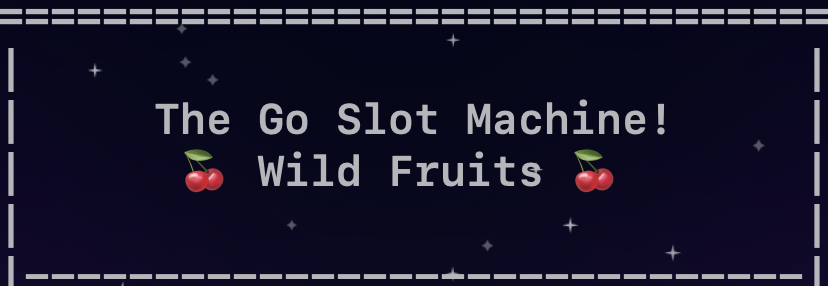

## Description

**The Go Slot Machine** is an open-source, interactive simulation crafted in Go, aimed at demystifying the core mechanics behind slot machines. This project not only serves as an educational resource for exploring gaming strategies and the principles of randomness but also showcases the versatility and power of Go for software development.

Designed with modularity in mind, the software allows users to experiment with different components such as random number generators (RNGs) and payout algorithms, making it an ideal platform for developers, students, and researchers interested in game theory, probability, and computer science education.

The project's open-source nature under the GNU General Public License v3.0 encourages a collaborative approach, inviting contributions that enhance its architecture and expand its functionality. Whether you're learning to code in Go, interested in the mathematics of gambling, or exploring software architecture, **The Go Slot Machine** offers a hands-on way to develop your skills and understanding in a practical, engaging environment.

The goal is to enhance the program by different games and other instances in a modular way.

## Disclaimer
**Educational Purposes Only**: This project is intended strictly for educational purposes and is not to be used for gambling, betting, or any form of real money play. The simulation is designed to provide insights into how slot machines work and to foster learning and discussion around game design and randomness. It is not a guide for gambling or an endorsement of gambling and should not be used as such.


## Table of Contents
- [Getting Started](#getting-started)
- [Usage](#usage)
- [Features](#features)
- [Customization](#customization)
- [Insights](#insights)
- [Contributing](#contributing)
- [License](#license)
- [Contact](#contact)

## Getting Started

### Prerequisites

- Go 1.22 or later
- Terminal with Unicode (UTF-8) (only for playing)

### Installation

1. Clone the repository to your local machine:

```sh
git clone https://github.com/codebrancher/go-slot-machine.git
cd go-slot-machine
```

2. Build the project:

```sh
go build -o slotmachine .
```

## Usage

Run the Go Slot Machine with the following command:

```sh
./slotmachine
```

This command will start the game and you will see the initial game setup information, including your starting cash balance.

### Game Commands

Once the game is running, you will interact with it using the following commands:

- `RETURN`: Hitting the return button re-bets with your last bet.
- `bet [bet amount]`: Places a bet of the specified amount.
- `auto [spins] [bet amount]`: Automatically play a specified number of spins with a fixed bet amount.
- `info`: Displays current game information, including available symbols, your current cash balance, and the wild symbol.
- `stats`: Displays current game statistics, such as total spins, total wins, and current cash balance.
- `exit`: Exits the game.

If you are in the `info` or `stats` screen you should make a `bet` or `auto`-bet to get back to the slot machine.

### Examples

Place a bet of 5:
```sh
bet 5
```
Spin 10 times with a bet of 5 each:
```sh
auto 10 5
```
Show game info:
```sh
info
```
View your stats:
```sh
stats
```
**Remember**: Hitting the `RETURN`-button will re-bet with your last bet.

## Features

Since this is a learning experience for me as well, here are some basic steps to get involved:

1. **Customizable Gameplay Settings**: Adjust starting cash, visual delay, and automatic spin intervals to suit various simulation or gameplay needs.
2. **Advanced Randomization**:  Choose from several randomizers, including the standard RNG, LCG, and XorShift, to ensure game fairness and complexity.
3. **Dynamic Game Mechanics**: Offers five potential winning lines and special features like bonus games that can extend by hitting additional bonus symbols.
4. **Interactive Commands**: Utilize commands such as bet, auto, and stats for real-time game management and engagement.
5. **Simulation Mode**: Toggle between interactive gameplay and simulation mode to conduct extensive tests or enjoy casual play.

**Additional Game Info**: The bonus symbols doesn't have to be in line to trigger bonus games. While you are in the bonus games hitting three more bonus symbols will extend the bonus games by two. For more infos on the game features checkout the screenshots.

## Insights

The following statistics were gathered over a simulated set of 100,000 spins to provide potential players and developers with an understanding of the game dynamics and expected outcomes.

**Simulation Statistics Overview with default settings:**

| Statistic              | Value   | Description                                                                                            |
|------------------------|---------|--------------------------------------------------------------------------------------------------------|
| Return to Player (RTP) | 99.03%  | The percentage of wagered money paid back to players over time. High RTP indicates a lower house edge. |
| Win Rate               | 39.14%  | Percentage of spins that result in a win.                                                              |
| Total Spins            | 100,000 | Number of spins played.                                                                                |
| Total Wins             | 39,144  | Total successful spins.                                                                                |
| Bonus Games Initiated  | 1,810   | Number of times bonus features were triggered.                                                         |
| Starting Cash          | 100,000 | Initial amount of cash at the start of the game.                                                       |
| Current Cash           | 99,158  | Remaining cash after the session.                                                                      |
| Total Win Amount       | 86,240  | Total amount won during the game.                                                                      |
| Total Bet Amount       | 87,082  | Total amount bet during the game.                                                                      |
| Max Drawdown           | 1,196   | Largest drop in cash balance during the game.                                                          |
| Net Profit/Loss        | -842    | Net earnings after all bets.                                                                           |
| Average Bet            | 1       | Average amount bet per spin.                                                                           |
| Average Win            | 2.20    | Average amount won per winning spin.                                                                   |
| Volatility             | 1.86    | Measure of the risk associated with the game.                                                          |
| Top Win                | 30      | Highest payout received in a single spin.                                                              |

**Insights from Statistics:**

- The high RTP (varies usually between 95% and 105%) and relatively moderate volatility indicate a game that returns a large portion of bets to players while still providing moderate fluctuating win and loss dynamics.
- The bonus games are represented usually with a rate between 1.8% to 2%.
- Despite the high number of total spins, the net profit/loss demonstrates the tight balance of the game mechanics designed to mimic real-world casino slot machines. This also gives insights into the amount of risk the player has to take.

These statistics help understand the expectations and behavior of the current game. Also you can use it to adjust features, payouts and frequencies.

## Customization

The program is intended to be as modular as possible to encourage experimentation. Explore the following parts to learn more about their specific functionalities, configurations and potentials:

### Game Engine

The core logic and game mechanics of a specific game are implemented here. [Learn more about the game engine.](internal/engine/README.md)

### Randomness Module

This module handles all random number generation used in the game. The program supports multiple algorithms to suit different needs. [Read about the randomness module.](internal/randomizer/README.md)

### Automated Play Simulation

For understanding the simulation setup and its configurations, refer to the documentation provided here. [Automated play and statistics.](cmd/README.md)

## Contributing

Thank you for your interest in contributing to the Go Slot Machine! This is my first open-source project, and I am excited to learn and grow with contributions from the community. Whether you have suggestions on how to make the code more modular, want to help improve the documentation, or have ideas for new features, your input is very welcome.

### How to Contribute

Since this is a learning experience for me as well, here are some basic steps to get involved:

1. **Explore the Project**: Take a look around the codebase to see what's already there and where you might be able to add value.
2. **Fork and Clone**: Make a fork of the repository, clone it to your machine, and set up a local development environment.
3. **Make Changes**: Work on the changes you think would enhance the project. This could be adding comments, refactoring code, or implementing new features.
4. **Submit a Pull Request**: Once you're happy with your changes, push them back to your fork and submit a pull request. I'll review it as soon as I can!

### Questions or Suggestions?

If you have questions about the project or need guidance on how to proceed, please feel free to open an issue in the repository. This is a learning experience for all of us, and every question or piece of feedback is valuable!

## License

The Go Slot Machine is open source and available under the GNU General Public License v3.0 (GPL-3.0). This license allows you to use, modify, and distribute the software, but all derivatives of this project must also be released under the same GPL-3.0 license.

For more details, see the [LICENSE](LICENSE) file included in the repository.

I chose the GPL-3.0 to ensure that all modifications and improvements to the project remain free and accessible, fostering a community of collaboration and shared improvement.

## Contact

If you have any questions, feedback, or would like to contribute to the Go Slot Machine project, please feel free to reach out through my [Twitter/X Account](https://twitter.com/codebrancher) or on GitHub.

For more detailed discussions, issue reporting, or to propose new features, consider opening an issue directly on the GitHub project page. This helps us keep track of all project-related discussions in one place.

Your input is incredibly valuable, and I look forward to hearing from you!
